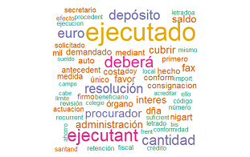
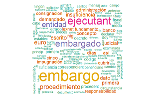
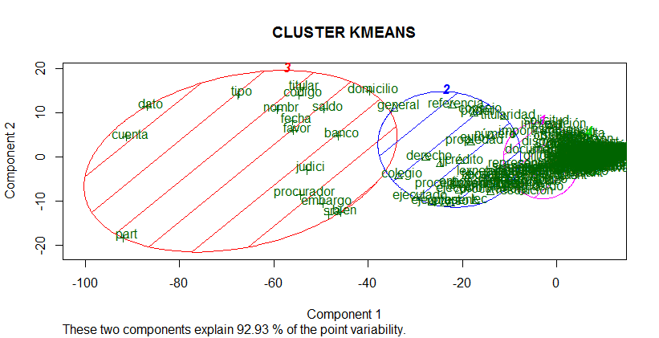
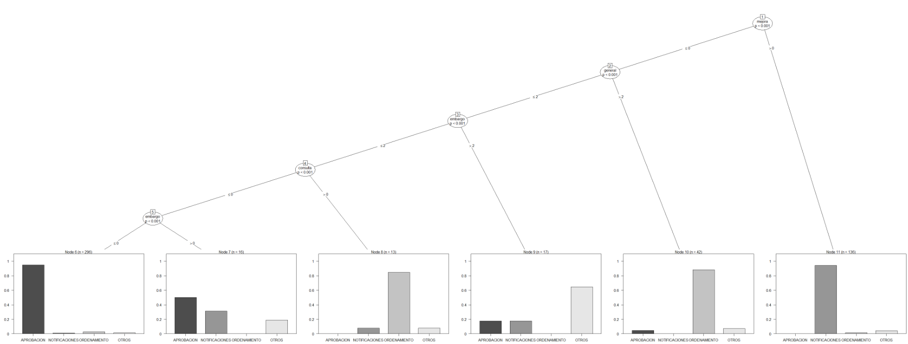

<style>
pre {
  font-family: 'Source Code Pro', 'Courier New', monospace;
  font-size: 14px;
  line-height: 20px;
  padding: 10px 0 10px 60px;
  letter-spacing: -1px;
  margin-bottom: 10px;
  width: 106%;
  left: -60px;
  position: relative;
  -webkit-box-sizing: border-box;
  -moz-box-sizing: border-box;
  box-sizing: border-box;
  /*overflow: hidden;*/
}

slides > slide {
  font-size: 18px;
 }
 h1, h2, h3 {
  font-weight: 400;
}
h2 {
  font-size: 35px;
  line-height: 65px;
  letter-spacing: -2px;
  color: #515151;
}
h3 {
  font-size: 20px;
  letter-spacing: -1px;
  line-height: 2;
  font-weight: inherit;
  color: #797979;
}
</style>

# CLASIFICACIÓN DOCUMENTAL: AYUDANDO A LEER

## INTRODUCCION

Más de 300 documentos de todo tipo se deben leer, clasificar y etiquetar, diariamente, por diversos departamentos. Cada nuevo proyecto en gestión genera incrementos enormes en el número de archivos (del orden de varios miles de golpe) que provocan sobrecarga/retrasos en todos los procesos cotidianos de trabajo.

Se desea acelerar/aligerar este proceso de clasificación de la documentación y automatizarlo en la medida de lo posible, al menos para aminorar la carga de trabajo y/o facilitar la vida a los diferentes departamentos. 

*No existen intentos previos de solucionar este problema.*

**La propuesta es: **

"Se puede extraer suficiente información de los documentos, **ANTES** de su lectura por una persona, de manera que se facilite un tratamiento y/o extracción específicos, y acelerar así el proceso o al menos impedir los retrasos en el resto de tareas".

El contenido se encuentra repartido en carpetas de un servidor en diversos formatos de documento: DOC, DOCX, RTF y PDF.


## ADVERTENCIA

**Debido a la información confidencial contenida en los documentos, estos no se aportan a la memoria.**

En esta, exclusivamente se reseñan los hitos del proceso y el análisis efectuado con R. 
El proyecto consta de carpetas para los datos en carpeta *data*, reportes de salida en *reports*, código bash/python en *code*.

Entre otros, se pueden comprobar: 

- [iPython Notebook con analisis exploratorio (code/PRELIMINAR.ipynb)](../code/PRELIMINAR.ipynb)

- [Resultado en HTML del iPython Notebook (reports/PRELIMINAR.html)](../reports/PRELIMINAR.html)

- [Bash Script para el proceso completo y gestion de archivos (code/extraccion.sh)](../code/extraccion.sh)
  
  Este bash script tiene parámetros obligatorios:
  
  carpeta origen, destino, numero de procesadores, nombre del documento resumen, departamento (en este orden).

- [Bash extracción resumen de datos para 1 departamento (code/resumen_juridico.sh)](../code/resumen_juridico.sh)


## ENTORNO

Rstudio + Jupyter Notebook con Pandas y MatplotLib en cliente Windows 7. 
Servidor de archivos Debian Linux con pdftotext, tesseract, convert, Libre Office CLI, parallel, ImageMagick, unoconv, poppler-utils, unidoc.

```{r eval=FALSE}
(.packages())

 [1] "knitr"   "gridExtra"  "ggplot2"     "party"    "strucchange"  "sandwich"            
 [7] "stats4"  "mvtnorm"    "grid"        "zoo"      "stats"        "graphics"                 
[13] "utils"   "datasets"   "methods"     "base"     "wordcloud"    "RColorBrewer"       
[19] "tm"      "NLP"        "graphics"    "grDevices" "SnowballCC"  "biclust"      
[25] "igraph"  "fpc"        "topicmodels" "Rcpp"     "NMF"  "modeltools"   "grDevices"
[32]  "ggplot2"  "cluster"    "grDevices"
 
 # SI DESEA INSTALAR LOS PAQUETES NECESARIOS EJECUTE ESTAS 3 LINEAS
 para.instalar <- c("knitr","gridExtra","ggplot2","party","strucchange","sandwich","zoo",
    "stats4","grid","modeltools","stats","graphics","grDevices","utils","datasets",
    "mvtnorm","methods","base","tm","wordcloud","RColorBrewer","ggplot2","NLP","graphics",
    "fpc","grDevices","SnowballCC","biclust","cluster","igraph","Rcpp","topicmodels","NMF")   

install.packages(para.instalar, dependencies=TRUE)   
install.packages("Rcampdf", repos = "http://datacube.wu.ac.at/", type = "source")   
```

## ANALISIS EXPLORATORIO

En el notebook iPython adjunto (*../reports/PRELIMINAR.html*) se puede ver un analisis exploratorio de más de 32.000 archivos que los usuarios depositan en un directorio tras leerlos y etiquetarlos. Para visualizar el código se puede pulsar el botón "VER CÓDIGO" o abrir el propio código Python alojado en la carpeta *code*: (*../code/PRELIMINAR.ipynb*). 

Los datos se obtienen con un volcado del comando **ls** a CSV. Con excel operamos para quedarnos con la extension, tamaño, fecha y etiqueta que han insertado en el nombre los diferentes departamentos al clasificar. Se adjunta dicho excel procesado en la misma carpeta que esta memoria (*data/procesados.xls*): 

Para ajustarse a la situación más reciente posible, obtenemos un CSV con frecuencias por tipo de documento de un día actual con documentos sin procesar.
```{r eval=FALSE}
#!/bin/bash
ls | awk -F . '{print $NF}' | sort | uniq -c | awk '{print $2,$1}' > files.csv
```

## VISUALIZACIÓN DE FRECUENCIAS
```{r limpieza, message=FALSE, warning=FALSE}
rm(list=ls())
```

```{r}
library(plyr); library(knitr)
files <- read.table("../data/files.csv", header = F)  
files <- rename(files,c("V1"="type","V2"="frequency"))
files <- files[2:nrow(files),]  # elimina primera fila (el directorio)
```
<div align="center">
```{r}
kable(files)
```


Nótese que la capitalización de las extensiones hace que detecte archivos del mismo formato como si fuesen distintas clases de archivo. En el notebook que analiza la carpeta de archivos ya procesados no aparece este hecho. Se tendrá en cuenta para más adelante.

```{r echo=FALSE}
barplot(files$frequency, names.arg = files$type)
```

## PLANTEAMIENTO INICIAL DEL FLUJO DE TRABAJO

1. Extracción del texto de los archivos tipo DOC y RTF.

2. Extracción del texto de los documentos PDF.

3. Extracción y recuento de palabras específicas solicitadas por cada departamento.

4. Clasificación de los documentos.


# EXTRACCIÓN DE TEXTO

## RTF Y DOC

Se opta por usar la línea de comandos de LibreOffice en lugar de **catdoc** o **unrtf** (daban problemas con imágenes embebidas), que además es extremadamente más rápido que estos últimos. 

El proceso es gestionado por el script de bash en el servidor (**code/extraccion.sh**). Dicho script se encarga de generar los directorios de trabajo necesarios, clasificar los documentos, abrirlos, extraer la información, obtener imágenes si existen, etcétera.

El mismo script se encarga de que todo deje registro en un log, generar tablas CSV con parámetros y metadatos de documento, llevar contabilidad para un informe final del proceso (**data/summary.log**) y medir los tiempos consumidos por cada fase.

*Se recomienda abrirlo con un editor de código para ver el proceso en detalle de manera paralela a esta memoria.*

Ejemplo de extracción de texto en archivo WORD
```{r eval=FALSE}
#!/bin/bash

libreoffice --invisible --norestore --convert-to txt:"Text" --headless $word_file \
                                                    --outdir ${OUTPUT}"/processed"
	
```

## PDF 

Los PDF están constituidos en ocasiones por imágenes. Siendo necesario abrirlos manualmente uno a uno para saberlo.

En caso afirmativo, para una correcta extracción del contenido, se hace necesario realizar un reconocimiento óptico de caracteres (OCR). Sin embargo, el OCR es muy costoso en tiempo y recursos. En pruebas iniciales con 400 pdf el proceso OCR tardó 3 días en completarse (1 core, 4 GB Ram).

Para analizar los PDF, mediante herramientas del sistema operativo (**poppler-utils**) se genera un CSV con metadatos de cada uno de ellos. Entre otros y sin ser exhaustivos:

- Número de imágenes (IMAGES), fuentes incrustadas (FONTS) y rotación de página (ROTATION).

- Líneas en primera página (FIRSTPAGELINES), numero total de palabras (TWORDS) y palabras en segunda página (PAGELINESSECOND).

- Frecuencia de las tres palabras más comunes en castellano según la RAE :de|la|que en primera página (FWORDS1).

[Link al corpus de la RAE](http://corpus.rae.es/lfrecuencias.html)

## Ejemplo de obtención de metadatos del PDF

En un bucle **for** que recorra todos los ficheros **$pdf_file**:
```{r eval=FALSE}
#!/bin/bash

# limpiar todos los caracteres extraños con expresiones regulares
firstpage=""$(pdftotext -f 1 -l 1 -enc UTF-8 "$pdf_file" - | tr -cd \
 '[[:alnum:]][áéíóúÁÉÍÓÚñѪºüÜ°;]\40-\040\045\054\011\012\014\015\057\050\051\100\056' \
                                              | sed '/^$/d' | sed 's/[^[:print:]]/ /g')

firstpagelines=""$(echo "$firstpage" | wc -l)    # líneas de primera pagina

fwords=""$(echo "$firstpage" | grep -E de\|la\|que | wc -l) # 3 mas frecuentes español

fonts=""$(pdffonts "$pdf_file" | wc -l)           # número de fuentes incrustadas

imagesp=""$(pdfimages -list "${pdf_file}" | wc -l)  # número de imágenes incrustadas

```

## PRIMERAS HIPÓTESIS

Las primeras hipótesis de trabajo analizando los metadatos PDF son:

- Documentos sin fuentes incrustadas indican que están compuestos de imágenes escaneadas (dimensión *fonts*).

- Documentos con muchas imágenes incrustadas indican igualmente la ausencia de texto parseable (dimensión *images*).

- Documentos que en primera página no cuentan con ninguna de las palabras más frecuentes en castellano son igualmente constituidos de imágenes (dimensión *fwords1*).

- Lo mismo reza para aquellos con escasas líneas en la primera página (dimensión *fistpagelines*).

Para tener un volúmen suficiente de documentos se solicita a las personas que los leen a diario, que al cerrarlos los renombren poniendo si son texto o imagen. Ante la duda o mezcla de ambos contenidos se etiquetan por defecto como imagen para forzar el OCR.

Con su ayuda al cabo de un tiempo disponemos de más de 400 documentos etiquetados para comenzar a probar.


## CLASIFICACIÓN PRELIMINAR: Texto/Imagen

Con el CSV de los metadatos se realiza un primer análisis exploratorio. 
Preparemos los datos para ver las correlaciones:
```{r }
pdf.metadata <- read.csv("../data/pdf_metadata.csv", sep=";", strip.white=TRUE)

# descartar el nombre del archivo. Para clasificación NO es util
tmp <- pdf.metadata[, !(colnames(pdf.metadata) %in% ("FILE"))]
 
```

```{r eval= FALSE}
# En la correlación logistica solamente hay 5 variables significativas

# LA SALIDA DE ESTE COMANDO SE OMITE POR BREVEDAD

fit <- glm(TIPO ~ . , data = tmp, family=binomial)

summary(fit)
```

## CORRELACIÓN 

```{r }
fit<-glm(TIPO ~ IMAGES + ROTATION + PAGELINESSECOND + FWORDS1 + TWORDS1,data=tmp,
                                                                    family=binomial)

# summary(fit) # solo las variables que son significativas
tmp <- tmp[,c("TIPO","IMAGES","ROTATION","PAGELINESSECOND","FWORDS1","TWORDS1","FONTS")]
```
 Coefficients  |  Estimate |Std. Error| z value |Pr(>z)| signif. |
 ------------- | --------- | -------- | ------- | ---- | ----|
(Intercept)    |  2.6857962| 0.2633980|10.197  |< 2e-16| *** |
IMAGES         |  0.0008252| 0.0003182| 2.593  | 0.0095| ** |
ROTATION       |  0.0142835| 0.0082926| 1.722  | 0.0850| .  |
PAGELINESSECOND| -0.0822938| 0.0116167|-7.084 |1.40e-12| *** |
FWORDS1        | -0.2120895| 0.0493709|-4.296 |1.74e-05| *** |
TWORDS1        | -0.0059823| 0.0030149|-1.984  | 0.0472| *  |

## VISUALIZACIÓN DE DENSIDAD EN DIMENSIONES

```{r, warning=FALSE}
library(ggplot2) ; library(gridExtra)

g.images <- ggplot(tmp, aes(IMAGES, fill = TIPO, colour = TIPO)) +
              geom_density(alpha = 0.6) + ggtitle("Número de Imágenes") +
              theme(axis.title.x=element_blank()) + xlim(0.20,250)

g.rotation <- ggplot(tmp, aes(ROTATION, fill = TIPO, colour = TIPO)) +
              geom_bar(alpha = 0.6) + ggtitle("Rotación de página") +
              theme(axis.title.x=element_blank())

g.pagl2 <- ggplot(tmp, aes(PAGELINESSECOND, fill = TIPO, colour = TIPO)) +
              geom_density(alpha = 0.6) + ggtitle("Líneas de texto en 2ª pág.") +
              theme(axis.title.x=element_blank()) + xlim(1,100)

ocr <- subset(tmp, TIPO=="ocr") ; txt <- subset(tmp, TIPO=="txt")
g.fwords1 <- ggplot(tmp, aes(FWORDS1, fill = TIPO, colour = TIPO), main = "RAE") +
                geom_density(alpha = 0.6) + theme(axis.title.x=element_blank()) +
                ggtitle("Frecuencias Corpus RAE")
```


```{r, warning= FALSE}
library(gridExtra)
grid.arrange(g.images, g.rotation, g.pagl2, g.fwords1,  ncol=2, nrow =2)
```


## PALABRAS, FUENTES y ALGO MÁS

```{r, warning=FALSE}
tmp2 <- pdf.metadata[,c("TIPO","TWORDS1","FONTS","PAGELINESFIRST","PAGELINESLAST")]

g.words1 <- ggplot(tmp2, aes(TWORDS1, fill = TIPO, colour = TIPO)) +
              geom_density(alpha = 0.6) +  ggtitle("Palabras en 1ª pág.") +
              theme(axis.title.x=element_blank()) + xlim(1,100)

g.fonts <- ggplot(tmp2, aes(FONTS, fill = TIPO, colour = TIPO)) +
              geom_density(alpha = 0.6) +  ggtitle("Fuentes incrustadas") +
              theme(axis.title.x=element_blank()) +  xlim(1,100)

g.pgl1 <- ggplot(tmp2, aes(PAGELINESFIRST, fill = TIPO, colour = TIPO)) +
              geom_density(alpha = 0.6) +  ggtitle("Líneas en 1ª pág.") +
              theme(axis.title.x=element_blank()) + xlim(1,100)

g.pglast <- ggplot(tmp2, aes(PAGELINESLAST, fill = TIPO, colour = TIPO)) +
              geom_density(alpha = 0.6) +  ggtitle("Líneas en última pág.") +
              theme(axis.title.x=element_blank()) +  xlim(1,100)
```


```{r, warning= FALSE}
grid.arrange(g.words1, g.fonts, g.pgl1, g.pglast, ncol=2, nrow =2)
```

**De modo general, cuando el PDF requiere OCR, hay mayor densidad (frecuencia) en cada variable en torno al valor cero. Con la excepción de las dimensiones IMAGES, ROTATION, FONTS y TWORDS1.**

## ÁRBOL DE CLASIFICACIÓN

```{r, warning= FALSE, message= FALSE}
library(party)

tmp3 <- pdf.metadata[, !(colnames(pdf.metadata) %in% ("FILE"))]

arbol.ct<-ctree(TIPO ~ IMAGES+ROTATION+PAGELINESSECOND+FWORDS1+TWORDS1+FONTS+PAGES+SIZE,
                                                                          data=tmp3)

reales.ct <- tmp3$TIPO

predichos.ct<- predict(arbol.ct)

confusion <- table(reales.ct, predichos.ct)

kable(confusion)
```


**En términos generales se confirman las sospechas. Los documentos para OCR tienen pocas fuentes incrustadas, pocas palabras, muchas imágenes y no poseen los 3 vocablos más frecuentes del Español en su primera página.** Sin embargo, deberá tenerse en cuenta que algunos de ellos son calificados como texto (ver matriz de confusión)
```{r}
plot(arbol.ct, tp_args = list(beside = TRUE))
```

## PUNTO DE CORTE

Sabido lo anterior, se define en el bash script **extraccion.sh** (líneas 310 a 364) la clasificación preliminar de los documentos con una mezcla de sentido común y de los indicios del árbol de la siguiente forma:

- Más de 20 páginas obliga a lectura (requisito de negocio). Se mueve a directorio *rejected*
- Fuentes incrustadas menor o igual a 1: se mueve a directorio *pdf_ocr*
- Menos de 3 en el conteo de 3 palabras más frecuentes en Español según RAE: a directorio *pdf_ocr*
- Más imágenes que páginas: se mueve a directorio *pdf_ocr*
- Más de 20 líneas de texto en primera página : se mueve a directorio *pdf_txt*

Como aún así es posible que algún PDF quede sin procesar, en las líneas 22-46 del script *code/resumen_juridico.sh* se comprueba que todos los textos extraidos tengan contenido. 

En tal caso se guarda el nombre del archivo en un log y se mueve a la carpeta *non processed* para revisión posterior al finalizar la ejecución del proceso. Puede ser interesante investigar qué tipo de archivos escapan a la conversión.

***

Gestión de ficheros vacíos. Primero comprobamos si tienen contenido, y si no es así se mueven.

```{r eval=FALSE}
#!/bin/bash
if [ "$en_documento" == 0 ];then

nombrepdf=$(basename $f .txt)".pdf"

nombresinext=$(basename $f .txt)

mv $f ../non_processed/
  
		if [ -f ${OUTPUT}"/pdf_ocr/"${nombrepdf} ]; then  # si estaba clasificado como OCR
		  mv "$OUTPUT/pdf_ocr/"${nombrepdf}  ../non_processed/
		fi
		  
		if [ -f ${OUTPUT}"/pdf_txt/"${nombrepdf} ]; then  # si estaba clasificado como TXT
		  mv "$OUTPUT/pdf_txt/"${nombrepdf}  ../non_processed/
		fi
		  
			echo $f >> ${OUTPUT}"/error.log"
fi
```

***

Una vez clasificados los PDF como "txt" o como "ocr" se pasa a extraer el contenido mediante *pdftotext* en el primer caso, y usando una combinación de *convert* (extrae las imágenes) y *tesseract* (realiza el OCR) en el segundo. 
En pruebas iniciales este proceso se revela extremadamente lento. Por ello con GNU Parallel lanzamos un hilo por cada nucleo del procesador (parámetro obligatorio **THREADS**).

Ejemplo de extracción de contenido en pdf compuesto por texto
```{r eval=FALSE}
#!/bin/bash

pdftotext -enc UTF-8  "$pdf_file" ${OUTPUT}/processed/${FILENAMEsinPDF}.txt

```

Ejemplo de extracción multihilo en pdf compuesto por imágenes escaneadas (GNU Parallel)
```{r eval=FALSE}
#!/bin/bash

# convert (extrae imágenes del PDF)

find . -name '*.pdf' | parallel -j ${THREADS} --progress convert -density 600 -trim {} \
-quality 100 -set filename:f '%t'  '../tmp/$(basename '{}' .pdf)'__%03d.jpg

# tesseract (ocr a los jpg extraidos)

find . -name '*.jpg' | parallel -j ${THREADS} --progress tesseract {} \
                                          -l spa '$(basename '{}' .jpg)'

```

Se obtiene como resultado del anterior proceso:

- Una imagen por cada página del documento.

- Un fichero de texto plano con el contenido interpretado mediante OCR por cada imágen del paso anterior.

Ahora se debe por tanto concatenar cada uno de los ficheros de texto en el mismo orden en que se lee en el PDF original.

Concatenado de los ficheros de texto con nombre del PDF original:
```{r eval=FALSE}
#!/bin/bash

for tt in "../tmp/"$(echo $nombrebase | sed -e 's/]/?/g')   #para cada fichero de texto
do
  FINALTXTNAME=$(echo ${nombrebase} | sed -e 's/\*//g') #capturamos nombre de PDF "padre"
    
	cat $tt | sed 's/\o14//g' | tr -cd '\11\12\15\40-\176' | sed '1 s/\xEF\xBB\xBF//'  \
	| sed '/^$/d' | sed 's/[^[:print:]]/ /g' | sed 's/-//g' | sed 's/_\._//g'       \
	| sed 's/"//g' | sed 's/_\.//g' | sed 's/"//g' | sed "s/'//g"             \
	>> ${OUTPUT}"/processed/"${FINALTXTNAME}
		
                rm -f $tt  # borramos todos los textos "hijo"
done

```

## PÉRDIDA DE INFORMACIÓN

Es esperable cierto grado de pérdida de información en el proceso OCR. Máxime cuando los archivos de origen son malas copias de un original, tienen tachaduras o escrituras a mano, imágenes torcidas, etc.

Para poder tener alguna idea de esta magnitud, se extrae un valor numérico de la pérdida sufrida, pasando el texto resultante por un diccionario (*aspell_es*) y computando el número de palabras que no se hallan en él.

Es una estimación muy burda, pues cosas como los nombres propios no se encontrarán, pero sirve al propósito de informar del ratio de pérdida de manera consistente para todos los documentos.

<div align="center">
$perdida=\frac{total NO encontradas en diccionario}{total palabras en documento}$
</div>

```{r eval=FALSE}
#!/bin/bash
for t in *.txt
do
  en_documento=$(cat "$t" | wc -w)     # contamos el total de palabras
	no_en_dicc=$(cat "$t" | aspell list | sort -u -f | wc -l) # aspell
	perdida=$(echo "scale=2;$no_en_dicc / $en_documento" |bc -l) # ratio calculado
	echo "$t tiene una pérdida de $perdida"  
done
```

## EXTRACCIÓN DE PALABRAS ESCOGIDAS

Cada departamento saca conclusiones y toma decisiones en base al contenido de cada pdf. 

En reuniones mantenidas a tal efecto, se recoge una lista de palabras clave que, según su experiencia, les ayuda a clasificar y decidir la importancia de cada documento. 

Esta lista de palabras se incorpora a un script separado por cada departamento que se cargará (o no) en función del parámetro obligatorio de entrada STYPE (lineas 465-469 del bash script **extraccion.sh**)

Este script realiza un parseo del texto por expresiones regulares, contabilizando tanto palabras sueltas como agrupadas, e incluso realizando una extracción tentativa de textos más complejos a un CSV.

**IMPORTANTE:**

*El citado script se aporta a modo de ejemplo aunque los textos a parsear se han sustituido por motivos de confidencialidad.*

## RESULTADOS PRELIMINARES Y FEEDBACK

El resultado de este primer tramo, genera una serie de directorios con los documentos clasificados según el proceso sufrido, y un archivo csv donde se reflejan la pérdida de la conversión y el total de palabras de cada uno de ellos: [data/accuracy.csv](data/accuracy.csv) 

Se muestran unas líneas:

 DOCUMENTO  |  PERDIDA | PALABRAS |
 ---------- | -------- | -------- |
F001        |   .22    |  211     |
F002        |     1    |    0     |
F003        |   .13    |  212     |
F004        |   .17    |   60     |
F005        |   .04    |  168     |
F006        |   .05    |  212     |


El feedbak de los diferentes departamentos es muy positivo, llevando procesados hasta el momento más de 25.000 documentos mediante este sistema desde la puesta en marcha.

Las mejoras en los tiempos son evidentes, pasando en el caso más exitoso, de una lectura/procesado promedio de 150 documentos a la semana, a más de 3.000 en el mismo periodo de tiempo. 

Los usuarios solamente acuden al documento original cuando la pérdida de información en el proceso supera el 15%. Para todo lo demás, operan sobre el CSV que contiene los resultados, con verificaciones ocasionales que hasta el momento no han informado de problemas.

Tanto es así, que se han asignado más recursos materiales al proyecto, y el hardware inicial, bastante limitado por ser una prueba piloto, ha escalado verticalmente y se dispone ahora de 4 veces más capacidad de proceso, habiéndose reducido los tiempos de la fase de cómputo a una cuarta parte.

***

# CLASIFICACIÓN POR CONTENIDOS

## UNOS PASOS MÁS

Se aprovecha este éxito inicial, para intentar ir un paso más allá y realizar una clasificación por temas.

El primer problema encontrado es, que aquellos pdf de mala calidad, tras el OCR generan un archivo de texto con muchas palabras que no corresponde con palabras reales.

Algunas de esas palabras son comprensibles aunque serían rechazadas por un diccionario (procurador ~ procurad**e**r). Por desgracia, ni *aspell* ni otros sistemas probados ofrecen una corrección automática. 

De modo que, esta vez se usa *aspell* para generar un listado completo de palabras no aceptadas, que posteriormente se revisarán para apreciar el éxito del OCR más allá del cálculo numérico de pérdida. 

```{r eval=FALSE}
#!/bin/bash
# volcar todas las palabras que no están en el diccionario a un archivo
 for file in *.txt
  do
  cat "$file" | tr '\n\r' ' ' | aspell list | sort -u -f >> base_stopwords.txt 
  done

# Orden por frecuencias únicas descendentes y revisar
 cat base_stopwords.txt | sort | uniq -c | sort -nr > cleaning_stopwords.txt

```

## RESULTADO (muestra)

```{r eval=FALSE}

#!/bin/bash
 cat stopwords.txt
    1249 ña
    1198 ENJ
    1188 Ia
    1165 fi
    1156 Not
    1156 Hash
    1144 Pérez
    1120 Álvaro
    1112 OF
    1106 pdf
     992 II
     989 Io
     987 ei
     981 ll
     880 INST
```

## DECISIÓN

Se puede ver que las mayores frecuencias son artefactos del OCR o nombres propios. Por tanto se decide dejar los textos tal cual pero seleccionar para la clasificación aquellos con más de 5 líneas y un máximo del 15% de pérdida. Este proceso se ejecuta mediante el bash script [../code/cleaner.sh](../code/cleaner.sh)

```{r eval=FALSE}

#!/bin/bash
 for f in *.txt
 do
lineas=""$(cat "$f" | wc -l)

if [ "$lineas" -gt 5 ]; then # más de 5 líneas

    # solamente letras, numeros,  espacios y separador de nueva linea
    limpio=""$(cat $f | tr -cd '[[:alnum:]][áéíóúÁÉÍÓÚñѪºüÜ°;-]\040\012' | sed '/^$/d' )
    
    en_documento=$(echo "$limpio" | wc -w)     # total de palabras
    no_en_dicc=$(echo "$limpio" | aspell list | sort -u -f | wc -l) # aspell inverso
    perdida=$(echo "($no_en_dicc / $en_documento)*100" | bc -l) # ratio

    if (( $(echo "$perdida < 15"|bc -l) )) ;then
            echo "$limpio" > cleaned/$f
    fi
fi
done
```

## DOCUMENT TERM MATRIX

Procedemos a generar la matriz de documentos necesaria con el paquete tm sobre los documentos escogidos en el anterior paso en caso de que nos fuera necesaria mayor precisión.

```{r, eval=FALSE}
library(tm)

# lectura del directorio de documentos (no aportado)
files <- DirSource(directory = "../documentos/",encoding ="UTF-8" )
docs <- VCorpus(x=files)

# transformaciones aplicadas al corpus
docs <- tm_map(docs, content_transformer(removePunctuation))
docs <- tm_map(docs, content_transformer(tolower))

docs <- tm_map(docs, removeWords,c("maria","garcia","jose",
                                   "julio","manuel","juan",
                                   "martinez","alvaro","perez"))

docs <- tm_map(docs, removeWords, stopwords("spanish"))
docs <- tm_map(docs, content_transformer(removeNumbers))

# el proceso elimina la barra que separa géneros en la palabra abogado: se hace corrige
docs<-tm_map(docs,content_transformer(function(x)stri_replace_all_fixed(x,"abogadoa",
                                                        "abogado",vectorize_all=FALSE)))
docs <- tm_map(docs, content_transformer(stripWhitespace))

# creación de la matriz DTM
dtm <- DocumentTermMatrix(docs)  
dtm <- removeSparseTerms(dtm, 0.9)

# Vamos a preservar el contenido de la matriz en disco para uso posterior
matriz <- as.matrix(dtm)
dim(matriz)
# pasamos a Data Frame
df <- as.data.frame(matriz)
# dar nombre a la columna rownames (index)
df <- cbind(FILENAMES = rownames(df), df)
# nos deshacemos de la rownames original
rownames(df) <- NULL
# escribimos a disco
write.csv(df, file="../data/df_dtm.csv", sep = ";")  
```


## WORD CLOUDS 

```{r eval=FALSE}
# extraemos la nube de palabras de los cuatro tipos de documentos existentes

library(wordcloud)

freq <- colSums(as.matrix(dtm)) 
set.seed(1234)   
wordcloud(names(freq), freq,min.freq=10, random.order=FALSE, rot.per=.20,
                                                  colors=brewer.pal(8,"Dark2")) 
```
             

             

## TOPIC MODEL

```{r eval=FALSE}
# generamos el topic model para el conjunto de todos los documentos mezclados
# asignamos al parámetro k el número de topics deseado (4)

library(topicmodels)

burnin <- 4000
iter <- 2000
thin <- 500

seed <-list(2003,5,63,100001,765)
nstart <- 5
best <- TRUE
k <- 4

freqs <- apply(dtm, 1, sum)
m     <- dtm[freqs > 0, ]
ldaOut <-LDA(m, k, method="Gibbs", control=list(nstart=nstart, seed = seed,
                                                best=best,burnin = burnin,
                                                iter = iter, thin=thin))
```

## CLUSTERS MEDIANTE KMEANS

```{r eval=FALSE}
library(fpc)   

d <- dist(t(dtm), method="euclidian")  

kfit <- kmeans(d, 4)   

clusplot(as.matrix(d),kfit$cluster,color=T,shade=T,labels=2,lines=0,main="CLUSTER KMEANS") 

# parece haber 4 temas claramente diferenciados de los cuales 2 tienden a solaparse
```

 


## TÉRMINOS MÁS FRECUENTES POR TEMA

```{r eval=FALSE}
ldaOut@terms
Terms <- terms(ldaOut, 10)
```
 Los 10 primeros términos para cada uno de los cuatro temas generados.
```{r}
library(knitr)
load("../data/temas.Rdata")
temas <- as.data.frame(temas)

kable(temas)
```


## PREDICCIÓN DE TEMAS


```{r }
library(party)
library(knitr)

# carga del CSV con los contenidos del dataframe de la DTM (disponible en carpeta data)
dtm.df <- read.csv("../data/df_dtm.csv", sep=";", stringsAsFactors=FALSE)

# Extraemos a un campo nuevo la etiqueta del tipo de documento 
# está inserta en el nombre entre el guión bajo y la extensión

inicio <- regexpr('[_]',dtm.df$FILENAMES)+1
fin <- regexpr('[.]',dtm.df$FILENAMES)-1

dtm.df$LABEL <- substring(dtm.df$FILENAMES, inicio , fin)

table(dtm.df$LABEL)

# descartar el nombre del archivo. Para clasificación NO es util
res <- dtm.df[, !(colnames(dtm.df) %in% ("FILENAMES"))]

res$LABEL<-as.factor(res$LABEL)

# guardamos a disco el nuevo data frame
write.csv(res, file="../data/resultado.csv", sep = ";")

arbol.temas <- ctree(res$LABEL ~ ., data = res)

reales.temas <- res$LABEL

predichos.temas <- predict(arbol.temas)

# MATRIZ DE CONFUSIÓN
temas.confusos <- table(reales.temas, predichos.temas)

kable(temas.confusos)

# plot del árbol de temas
# ATENCIÓN: por su tamaño, el CTREE no logra verse completo al detalle
# se adjunta en alta resolución en la  carpeta ../plots/arbol_temas.png

```

```{r eval=FALSE}
plot(arbol.temas, tp_args = list(beside = TRUE))
```


 


A partir de las indicaciones de este último árbol se implementa un script (*../code/clasificador.sh*) que vuelca a CSV (*../data/predicitivo_temas.csv*) la clasificación obtenida. 

Este CSV se ha entregado a los correspondientes departamentos para que cotejen su fiabilidad.


```{r eval=FALSE}
#!/bin/bash

	
	contiene_mejora=""$(echo "$CONTENIDOF" | grep -E -i -o -c '\bmejora\b')
	contiene_general=""$(echo "$CONTENIDOF" | grep -E -i -o -c '\bgeneral\b')
	contiene_embargo=""$(echo "$CONTENIDOF" | grep -E -i -o -c '\bembargo\b')
	contiene_consulta=""$(echo "$CONTENIDOF" | grep -E -i -o -c '\bconsulta\b')
	tema_detectado="desconocido"

# clasificación por contenido extraída a partir de arbol de inferencia con R
		   
		if [ $contiene_mejora -gt 0 ]; then  
				
				tema_detectado="NOTIFICACIONES"
				
			else
		   
					if [ $contiene_general -gt 2 ]; then  
					
						tema_detectado="ORDENAMIENTO"
					
					else
				
						if [ $contiene_embargo -gt 2 ]; then   
						
									tema_detectado="OTROS"
					
							else
							
								if [ $contiene_consulta -gt 0 ]; then
									
										tema_detectado="ORDENAMIENTO"
										
									else
									
										if [ $contiene_embargo -gt 0 ]; then
										
										tema_detectado="APROBACION-NOTIFICACIONES-OTROS"
										
										else
										
										tema_detectado="APROBACION"
											
										fi
										
								fi
							
							fi
					
						
						fi 
			fi

```


```{r}

# carga del CSV con los contenidos del csv predictivo_temas (disponible en carpeta data)
predictivo.temas <- read.csv("../data/predictivo_temas.csv", sep="^",
                                                stringsAsFactors=FALSE)

# muestra de los contenidos
kable(head(predictivo.temas))

```

En estos momentos se están realizando los primeros ensayos y queda por recibir el feedback de los diferentes departamentos, que esperamos, sea tan positivo como el de la primera clasificación y extracción de contenidos.

En futuras revisiones del proyecto tras recibir el feedback se incorporarán al proyecto todas las sugerencias que sean susceptibles de implementación.

# CONCLUSIONES

## **Se ha logrado en gran medida el objetivo.**

Los procesos de lectura y clasificación se han acelerado mucho, principalmente en la primera fase de extracción de contenidos. 

Tal y cómo hemos mencionado con anterioridad, se logran procesar más de 3.000 documentos a la semana cuando antes era habitual unos 150 en el mismo periodo de tiempo. 

El número total de documentos procesados superó este mes los 26.000 dado que se ha solicitado incluso que se aplique esta metodología a antiguos proyectos

Los procesos de clasificación, por las noticias que tenemos, se han acelerado igualmente, aunque queda por evaluar la precisión del sistema predictivo y articular mecanismos de verificación en caso de ser necesario a partir de las indicaciones de cada uno de los departamentos.


                                                      Jose Manuel Vera Oteo, en Madrid, a 2 de Junio de 2016


